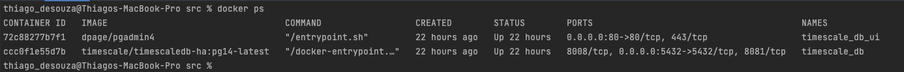
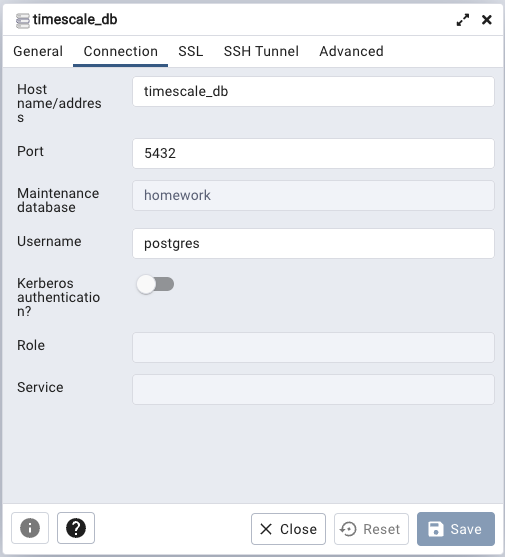
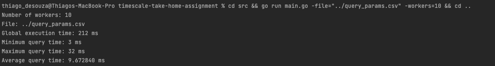

# Cloud Engineer Assignment - Benchmarking

## Description
This project aims to purpose a solution for the benchmaking problem proposed as a 
take home assignment for a Cloud Engineer position at [Timescale](https://www.timescale.com/)
The full problem description can be found [here](./docs/PROBLEM.md)

## Solution
This software was written in [go lang](https://go.dev/) (version 1.19) and uses docker containers to 
build up the development environment. Please make sure you have these softares already set to be able 
to run it.

## Dev Environment
To spin up a new timescale instance I created a [docker-compose file](./docker/docker-compose.yml) with a timescale 
instance and also a pgadmin instance to be able to query the database without needing to install any client. 

To run all the containers please execute:
```shell
make dev_start
```
Once the stack is up you can check the containers running
```shell
docker ps
```
You should see something similar to:


## Database initial load
The timescale container is initialized with the [cpu_usage.sql](./docker/db-init-scripts/cpu_usage.sql) so 
you don't need to worry about database, extension or table creation. The only needed step is to populate the table 
with the [provided csv file](./docker/db-init-scripts/cpu_usage.csv).

To populate the database please execute:
```shell
make db_setup
```

To run queries you can open [pgadmin](http://localhost) using the credentials valverde.thiago@gmail.com/t1m35c@13.
To configure the connection between pgadmin and timescale use the following settings:


## Running the project
Inside the [source](./src) folder you can run the project using
```shell
go run main.go 
```
Or simply runs the following from the root folder
```shell
cd src && go run main.go && cd ..
```
Any of the above commands will run the software with the default options (args). To customize them use the command as follows:
```shell
go run main.go -file="../query_params.csv" -workers=10

```
Or simply runs the following from the root folder
```shell
cd src && go run main.go -file="../query_params.csv" -workers=10 && cd ..
```

where:
- `-file` sets the path for the csv file to be processed
- `-workers` sets the number of workers (threads)
The output would be similar with:

